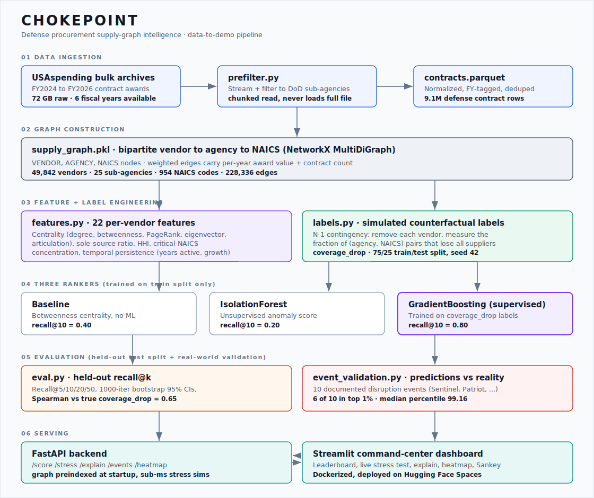

# CHOKEPOINT

> Defense procurement supply-graph intelligence - find the single vendors whose failure would collapse mission coverage, before a disruption finds them first.
> USAspending · NetworkX · scikit-learn · GradientBoosting · MLflow · FastAPI · Streamlit · Docker · Hugging Face Spaces


**Live demo:** https://atharvahirulkar-chokepoint.hf.space/
`/score` · `/stress` · `/explain` · `/events` · `/heatmap` · `/health` · `/docs`

---

## What this is

CHOKEPOINT is an end-to-end ML system that finds structural single points of failure in the U.S. defense industrial base. It streams three fiscal years of public USAspending contract awards into a vendor-to-agency-to-NAICS supply graph, then ranks every vendor by a supervised model that learns from simulated vendor-failure outcomes. The best ranker is served through a FastAPI backend and a Streamlit command-center dashboard, both containerized and deployed live on Hugging Face Spaces.

The hard part is not the model, it is the evaluation. There is no public ground truth for which vendors are systemic chokepoints, so I generate labels by simulating vendor removal on the graph (N-1 contingency analysis) and validate the result against ten publicly documented real-world disruption events. On a held-out test split the supervised model places 80 percent of true chokepoints in its top 10, double the centrality baseline, and 6 of 10 real events land in the top 1 percent of a 49,842-vendor ranking.

---

## Architecture



Data to demo in six stages: stream-filter the raw archives, build the graph, engineer features and simulated labels, train three rankers, evaluate on a held-out split plus real events, and serve through an API and dashboard.

---

## Stack

| Layer | Technology |
|---|---|
| Data source | USAspending bulk contract archives (FY2024 to FY2026) |
| Graph | NetworkX MultiDiGraph (in-memory analytical substrate) |
| Models | GradientBoosting (supervised), IsolationForest (unsupervised), betweenness baseline |
| Experiment tracking | MLflow |
| Feature + label engineering | pandas, NetworkX, scikit-learn |
| API framework | FastAPI + Uvicorn |
| Data validation | Pydantic v2 |
| Dashboard | Streamlit + Plotly + pyvis |
| Containerization | Docker + Docker Compose |
| Deployment | Hugging Face Spaces (Docker SDK) |
| Language | Python 3.11 |

---

## Results

Evaluated on a held-out test split (250 vendors, 10 positives) the supervised model never sees during training. Confidence intervals are 1000-iteration percentile bootstraps.

| Ranker | Recall@5 | Recall@10 | Recall@20 | Recall@50 |
|---|---|---|---|---|
| Betweenness baseline | 0.20 | 0.40 | 0.40 | 0.40 |
| IsolationForest (unsupervised) | 0.10 | 0.20 | 0.50 | 0.80 |
| **GradientBoosting (supervised)** | **0.40** | **0.80** | **0.90** | **1.00** |

The supervised model wins at every cutoff and beats centrality by 2x at recall@10 and recall@20. Spearman rank correlation against true simulated coverage drop on the test split: baseline 0.47, IsolationForest 0.50, supervised model **0.65**.

### Validation against real events

I matched ten publicly documented defense supply-chain disruption events (2022 to 2024) against the model ranking out of 49,842 vendors. Sources include DoD acquisition reports, GAO reports, NDAA filings, and FTC merger filings.

| Result | Value |
|---|---|
| Events in the top 1 percent | 6 of 10 |
| Events in the top 10 percent | 8 of 10 |
| Median percentile | 99.16 |

Examples: Sentinel ICBM cost breach (Northrop, rank 5), Patriot interceptor capacity (Raytheon, rank 7), Columbia-class submarines (General Dynamics, rank 318), Boeing KC-46 (rank 393). The two misses (Aerojet Rocketdyne and TransDigm) fail because their concentration is split across subsidiaries and acquired-parent rollups, the exact vendor-identity limitation the production roadmap calls out. Aerojet was acquired by L3Harris in 2023, and L3Harris itself ranks in the top 1 percent.

---

## How the model is trained and evaluated

There is no public list of real chokepoints, so I generate labels by **simulated counterfactual removal**, which is N-1 contingency analysis borrowed from power-systems engineering and closely related to DebtRank and SinkRank in financial systemic-risk literature.

```
For each vendor in the top-1000 candidate pool (by graph footprint):
        │  remove the vendor from a copy of the graph
        ▼
  count (agency, NAICS) pairs that now have zero suppliers
        │
        ▼
  coverage_drop = lost_pairs / served_pairs        ← the supervised label
        │
        ▼
  75 / 25 train/test split (seed 42)
  train GradientBoosting on train split only
  report every metric on the held-out test split
```

The betweenness baseline and the IsolationForest are scored on the same held-out vendors so the comparison is fair.

### Feature importance

| Feature | Importance |
|---|---|
| `sole_source_breadth` = sole_source_ratio x log(NAICS count) | 33 percent |
| `critical_breadth` = sole_source_ratio x log(critical-NAICS count) | 31 percent |
| `footprint` = log(agencies) x log(NAICS count) | 19 percent |
| Raw centrality, log counts, HHI, temporal features | under 5 percent each |

Three engineered interaction features carry roughly 80 percent of the signal, so the model is interpretable rather than a black box. I also engineered temporal persistence features (years active, year-over-year growth, emerging-concentration flags). They added no predictive lift over the structural signals, which I report as an honest null result and keep in the system as descriptive analyst-facing labels.

---

## Project Structure

```
chokepoint/
├── pipeline/
│   ├── prefilter.py            # Stream FY2024-2026 archives → defense-only parquet
│   ├── ingest.py               # Normalize vendor names, NAICS, drop null awards
│   ├── build_graph.py          # Vendor-agency-NAICS MultiDiGraph, per-year edges
│   ├── features.py             # 22 per-vendor features (centrality, sole-source, HHI, temporal)
│   ├── critical_naics.py       # DoD Critical Technology Areas NAICS list
│   ├── labels.py               # Simulated removal coverage_drop labels + train/test split
│   └── event_validation.py     # Match real disruption events to model ranks
├── models/
│   ├── train.py                # Baseline + IsolationForest + supervised GB, MLflow tracking
│   └── eval.py                 # Held-out recall@k, bootstrap CIs, Spearman, critical-mode
├── api/
│   ├── main.py                 # FastAPI app, request logging, metrics
│   ├── schemas.py              # Pydantic response models
│   ├── state.py                # Preloads graph + scores, preindexes coverage map
│   └── routers/
│       ├── score.py            # GET /score   - leaderboard, calibrated risk tiers
│       ├── stress.py           # GET /stress  - live vendor-removal simulation
│       └── explain.py          # GET /explain - feature contributions + rationale
├── dashboard/
│   └── app.py                  # Streamlit command-center dashboard
├── deploy/hf_space/            # Hugging Face Space bundle (combined image + deploy script)
├── docs/assets/architecture.svg
├── data/processed/             # Parquet + eval artifacts (gitignored, tracked via LFS on deploy)
├── Dockerfile.api
├── Dockerfile.dashboard
├── docker-compose.yml
├── Makefile
├── requirements.txt
└── README.md
```

---

## API Reference

### `GET /stress/{vendor_name}`

```json
// GET /stress/RAYTHEON
{
  "vendor_name": "RAYTHEON",
  "coverage_drop": 0.043,
  "critical_coverage_drop": 0.071,
  "naics_affected": 32,
  "critical_naics_affected": 6,
  "agencies_impacted": 10,
  "pairs_served": 480,
  "pairs_lost": 73,
  "top_vulnerable_naics": [
    "SPACE RESEARCH AND TECHNOLOGY",
    "OTHER MOTOR VEHICLE PARTS MANUFACTURING"
  ]
}
```

### `GET /score?limit=20&sort_by=model_score`

Returns the top-K vendors by `model_score`, `baseline_score`, or `iso_score`, each with calibrated risk tier and the structural features behind the score.

### `GET /events`

Returns the predictions-vs-reality validation table: each documented disruption event, the matched vendor, and its rank and percentile across all three rankers.

### Other endpoints

| Endpoint | Description |
|---|---|
| `GET /health` | vendors loaded, graph node and edge counts |
| `GET /explain/{vendor_name}` | feature contributions, risk tier, templated rationale |
| `GET /heatmap/critical` | sub-agency by critical-NAICS supplier-count matrix |
| `GET /eval` | full evaluation report (recall@k, CIs, top chokepoints) |
| `GET /metrics` | request counter, average latency, stress-sim count |

---

## Quickstart

> **Prerequisites:** Python 3.11+ · Docker Desktop · USAspending bulk contract archives (free download)

```bash
# 1. Clone and install
git clone https://github.com/atharvahirulkar/chokepoint.git
cd chokepoint
python -m venv .venv && source .venv/bin/activate
pip install -r requirements.txt

# 2. Place USAspending archives under data/raw/
#    FY{year}_All_Contracts_Full_*/  (FY2024, FY2025, FY2026)
#    https://www.usaspending.gov/download_center/award_data_archive

# 3. Build the full pipeline
make prefilter   # stream + filter to defense sub-agencies, FY-tagged
make graph       # vendor-agency-NAICS MultiDiGraph
make features    # 22 per-vendor features
make labels      # simulated removal coverage_drop labels, train/test split
make train       # baseline + IsolationForest + supervised GradientBoosting
make eval        # held-out recall@k with bootstrap CIs
make events      # validate against documented real-world disruptions

# 4. Serve locally
make serve       # FastAPI on :8000
make dashboard   # Streamlit on :8501

# 5. Or run the full stack with Docker
docker compose up --build
# API:        http://localhost:8000/docs
# Dashboard:  http://localhost:8501
```

---

## Dataset

[USAspending Award Data Archive](https://www.usaspending.gov/download_center/award_data_archive) - bulk contract award files, FY2024 to FY2026. I stream-filter the raw 72 GB of CSVs down to defense sub-agency awards, yielding 9.1 million rows. The resulting graph has 49,842 vendors, 25 sub-agencies, 954 NAICS codes, and 228,336 weighted edges. Public data only, no scraping, fully reproducible.

---

## Limitations and production roadmap

| Limitation | What production would need |
|---|---|
| Vendor identity is name-string based, so subsidiaries and acquired parents are not unified (the Aerojet and TransDigm misses) | CAGE or UEI as the vendor primary key with parent rollup |
| Simulated coverage drop is a proxy for real failures, not a substitute | Validation against a curated registry of realized disruption events |
| Small positive set (10 test positives) gives wide bootstrap intervals | More fiscal years, more candidate-pool depth |
| Bulk archives are static snapshots | Real-time SAM.gov and USAspending API ingestion |
| In-memory NetworkX pickle | Graph database (Neo4j or Memgraph) as the storage layer |

---

## Status

- [x] Streaming ingestion of FY2024-2026 USAspending archives (`prefilter.py`)
- [x] Vendor-agency-NAICS supply graph with per-year edge attributes (`build_graph.py`)
- [x] 22 per-vendor features - centrality, sole-source, HHI, critical-NAICS, temporal (`features.py`)
- [x] Critical-NAICS module aligned to DoD CTA / DPA Title III / NDAA 2022 Sec 855 (`critical_naics.py`)
- [x] Simulated counterfactual labels via N-1 removal + train/test split (`labels.py`)
- [x] Three rankers - betweenness baseline, IsolationForest, supervised GradientBoosting (`train.py`)
- [x] MLflow experiment tracking
- [x] Held-out evaluation - recall@k, 1000-iter bootstrap CIs, Spearman (`eval.py`)
- [x] Real-event validation against 10 documented disruptions (`event_validation.py`)
- [x] FastAPI backend - score, stress, explain, events, heatmap, health, metrics
- [x] Streamlit command-center dashboard - leaderboard, live stress test, explain, heatmap, Sankey
- [x] Docker images + docker-compose for API and dashboard
- [x] Deployed live on Hugging Face Spaces
- [ ] CAGE/UEI parent rollup for vendor identity (production)
- [ ] Real-time SAM.gov ingestion (production)

---

## Author

**Atharva Hirulkar** - MS Data Science, UC San Diego  
[GitHub](https://github.com/atharvahirulkar) · [LinkedIn](https://linkedin.com/in/atharva-hirulkar)
